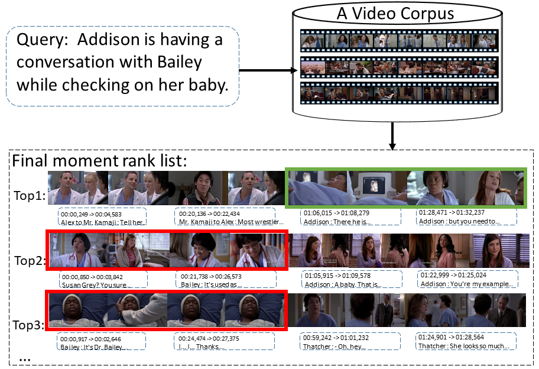
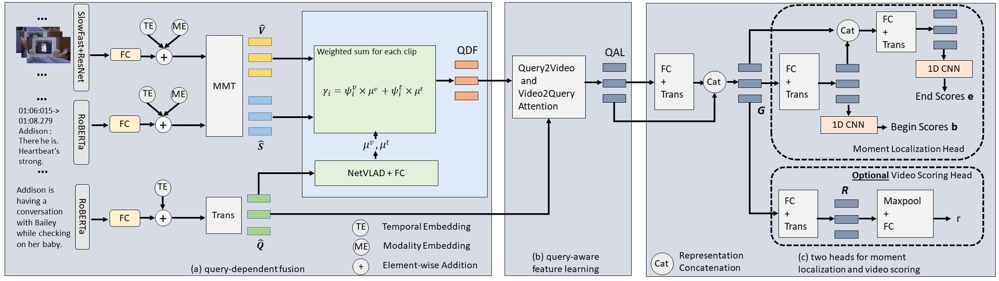

# CONQUER: Contexutal Query-aware Ranking for Video Corpus Moment Retreival
PyTorch implementation of CONQUER: Contexutal Query-aware Ranking for Video Corpus Moment Retreival.

### Task Definition

Given a natural language query, e.g., Addison is having a conversation with Bailey while checking on her baby, 
the problem of Video Corpus Moment Retrieval, is to locate a precise moment in a video retrieved from a large video corpus.
And we are especially interested in the more pragmatic scenario, videos are additionally associated with the text descriptions such as subtitles or ASR (automatic speech transcript).




### Model Overiew
CONQUER: 
+ Query-dependent Fusion (QDF) 
+ Query-aware Feature Learning (QAL) 
+ Moment localization (ML) head and optional video scoring (VS) head




## Getting started
### Prerequisites
1 . Clone this repository
```
git clone https://github.com/houzhijian/CONQUER.git
cd CONQUER
```

2 . Prepare feature files and data

Download [tvr_feature_release.tar.gz](https://drive.google.com/file/d/1DFnMNH-oi6-cZbl1coXqa_KjtsIsObxG/view?usp=sharing) (21GB). 
After downloading the feature file, extract it to **YOUR DATA STORAGE** directory:
```
tar zxvf path/to/tvr_feature_release.tar.gz 
```
You should be able to see `tvr_feature_release` under **YOUR DATA STORAGE** directory. 

It contains visual features (ResNet, SlowFast) obtained from [HERO](https://github.com/linjieli222/HERO/) authors and text features (subtitle and query, from fine-tuned RoBERTa) obtained from [XML](https://github.com/jayleicn/TVRetrieval) authors. 
You can refer to the code to learn details on how the features are extracted: 
[visual feature extraction](https://github.com/linjieli222/HERO_Video_Feature_Extractor), [text feature extraction](https://github.com/jayleicn/TVRetrieval/tree/master/utils/text_feature). 

Then modify `root_path` inside config/tvr_data_config.json to your own root path for data storage.

3 . Install dependencies.
- Python 
- PyTorch 
- Cuda 
- tensorboard
- tqdm
- lmdb
- easydict
- msgpack
- msgpack_numpy

To install the dependencies use conda and pip, 
you need to have anaconda3 or miniconda3 installed first, then:
```
conda create --name conquer
conda activate conquer 
conda install python==3.7.9 numpy==1.19.2 pytorch==1.6.0 cudatoolkit=10.1 -c pytorch
conda install tensorboard==2.4.0 tqdm
pip install easydict lmdb msgpack msgpack_numpy
```

### Training and Inference
*NOTE*: Currently only support train and inference using one gpu. 

We give examples on how to perform training and inference for our CONQUER model.

1 .  CONQUER training

```
bash scripts/TRAIN_SCRIPTS.sh EXP_ID CUDA_DEVICE_ID
```
`TRAIN_SCRIPTS` is a name string for training script.
`EXP_ID` is a name string for current run. 
`CUDA_DEVICE_ID` is cuda device id.

Below are four examples of training CONQUER when

+ it adopts general similarity measure function without shared normalization training objective : 
```
bash scripts/train_general.sh general 0 
```

+ it adopts general similarity measure function with three negative videos and extend pool size 1000:   
```
bash scripts/train_sharednorm_general.sh general_extend1000_neg3 0 \
--use_extend_pool 1000 --neg_video_num 3 --bsz 16
```

+ it adopts disjoint similarity measure function with three negative videos and extend pool size 1000:   
```
bash scripts/train_sharednorm_disjoint.sh disjoint_extend1000_neg3 0 \
--use_extend_pool 1000 --neg_video_num 3 --bsz 16
```

+ it adopts exclusive similarity measure function with three negative videos and extend pool size 1000:   
```
bash scripts/train_sharednorm_exclusive_pretrain.sh exclusive_pretrain_extend1000_neg3 0 \
--use_extend_pool 1000 --neg_video_num 3 --bsz 16 --encoder_pretrain_ckpt_filepath path/to/first_stage_trained_model/model.ckpt
```

*NOTE*: The training has randomness when we adopt shared normalization training objective, because we randomly sample negative videos via an adpative pool size. You will witness performance difference each time.

2 .  CONQUER inference

After training, you can inference using the saved model on val or test_public set:
```
bash scripts/inference.sh MODEL_DIR_NAME CUDA_DEVICE_ID
```
`MODEL_DIR_NAME` is the name of the dir containing the saved model, 
e.g., `tvr-general_extend1000_neg3-*`. 
`CUDA_DEVICE_ID` is cuda device id.

By default, this code evaluates all the 3 tasks (VCMR, SVMR, VR), you can change this behavior 
by appending option, e.g. `--tasks VCMR VR` where only VCMR and VR are evaluated. 


Below is one example of inference CONQUER which produce the best performance shown in paper.

2.1. Download the trained model [tvr-conquer_general_paper_performance.tar.gz](https://drive.google.com/file/d/1okbLCyR1U12Kw4qcjRpCk8lbF8FXyzFi/view?usp=sharing) (173 MB). 
After downloading the trained model, extract it to the current directory:
```
tar zxvf tvr-conquer_general_paper_performance.tar.gz
```
You should be able to see `results/tvr-conquer_general_paper_performance` under the current directory. 

2.2. Perform inference on validation split
```
bash scripts/inference.sh tvr-conquer_general_paper_performance 0 --nms_thd 0.7
```
We use non-maximum suppression (NMS) and set the threshold as 0.7, because NMS can contribute to
a higher R@5 and R@10 score empirically.

## Citation
If you find this code useful for your research, please cite our paper:
```
@inproceedings{hou2020conquer,
  title={CONQUER: Contextual Query-aware Ranking for Video Corpus Moment Retrieval},
  author={Zhijian, Hou and  Chong-Wah, Ngo and Wing-Kwong Chan},
  booktitle={Proceedings of the 29th ACM International Conference on Multimedia},
  year={2021}
}
```

## Acknowledgement
This code borrowed components from the following projects: 
[TVRetrieval](https://github.com/jayleicn/TVRetrieval), 
[HERO](https://github.com/linjieli222/HERO/), 
[HuggingFace](https://github.com/huggingface/transformers), 
[MMT](https://github.com/gabeur/mmt), 
[MME](https://github.com/antoine77340/Mixture-of-Embedding-Experts). 
We thank the authors for open-sourcing these great projects!

## Contact
zjhou3-c [at] my.cityu.edu.hk
